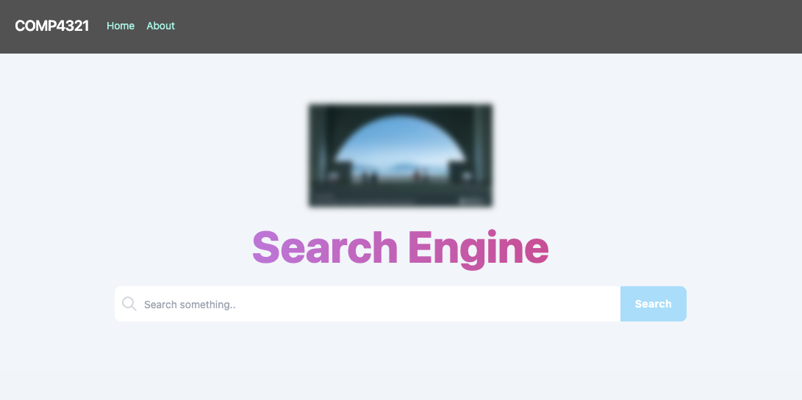

# COMP4321 Web Search Engine (backend)

**Solo project** — Course project for HKUST COMP 4321. A web search engine with three main parts: **crawler**, **retrieval system**, and **search engine website**.

- **Crawler**: Recursively fetches and parses textual data from the web and persists it for indexing.
- **Retrieval**: Applies TF×IDF, Google’s PageRank, and weighted search to user queries and parsed data, returning the top 50 results.
- **Website**: User-friendly interface to access the search engine.

### Highlights

- **Web crawler & indexer**: Implemented a multi-step pipeline for web data acquisition and storage. The crawler traverses the web recursively using a **breadth-first search (BFS)** strategy to discover and fetch pages in a controlled, level-by-level manner. A dedicated indexer processes the parsed content and persists it into a **custom-designed JDBM-backed schema**, enabling efficient storage and lookup for the retrieval layer.

- **Retrieval & ranking**: Built the search backend on the **vector space model**. Terms are weighted using **TF-IDF**; document–query similarity is computed via **cosine similarity**, and results are combined with **PageRank** and weighted scoring to produce the top-ranked results for each query.

*Course outcome: final grade A+.*

## Building & running

### `npm install`

To install all the required dependency

### `npm start`

Runs the app in the development mode.\
Visit the development server at http://localhost:3000 with your browser.

The page will reload when you make changes.\
You may also see any lint errors in the console.

## Related Repositories

This is the frontend component of the COMP4321 Project. The backend is available at:
- [COMP4321-Project-backend](https://github.com/terryychiuu/COMP4321-Project-backend)

## Project Demo
- [Watch the demo on YouTube](https://youtu.be/VRCBY92hB9c)

